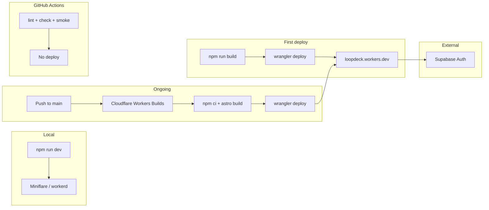

# Plan pierwszego wdrożenia Loopdeck

## Ocena planu (v1 → v2)

| Obszar | Ocena v1 | Poprawka w v2 |
|---|---|---|
| Stack alignment | Dobry | Bez zmian — adapter i `wrangler.jsonc` już gotowe |
| Deploy strategy | Dobry | Wyraźniejszy podział: Cloudflare Builds ≠ GitHub Actions deploy |
| Supabase auth | **Luka** | Dodano konfigurację email confirmation (wymagane przez smoke test) |
| Kolejność kroków | **Luka** | Dwuetapowa konfiguracja Supabase URL (przed/po pierwszym deployu) |
| Weryfikacja prod | Częściowa | Dodano `npm run smoke` z `BASE_URL` produkcyjnym |
| Prerequisites CLI | Brak | Dodano Faza 0 z Node 22, Wrangler, kontami |
| Gałąź CI | Wspomniana | Konkretna zmiana `master` → `main` w `.github/workflows/ci.yml` |
| Cloudflare Builds | Dobry | Dodano wersję Node 22 i rozróżnienie build env vs worker secrets |
| Rollback / ops | Dobry | Bez zmian |

**Wniosek:** Plan v1 był poprawny architektonicznie, ale pomijał konfigurację Supabase Auth pod produkcyjny flow (email confirmation blokuje sign-in w smoke teście) oraz prerequisites CLI. v2 jest gotowy do wykonania.

---

## Status implementacji (2026-09-13)

| Faza | Status | Uwagi |
|---|---|---|
| F0 | Częściowo | `git init` + gałąź `main`; CI `master` → `main`. Brak remote GitHub, brak `wrangler login` |
| F1 | Oczekuje | Wymaga ręcznej konfiguracji Supabase Dashboard (confirm email OFF) |
| F2 | **Done** | `wrangler.jsonc` → `loopdeck`; `tech-stack.md` → `cloudflare-workers` |
| F3 | Częściowo | `lint`, `astro check`, `build`, `wrangler deploy --dry-run` PASS. Smoke zablokowany (Docker rate limit przy `supabase start`) |
| F4 | Oczekuje | `wrangler whoami` → not authenticated; wymaga OAuth + sekretów cloud Supabase |
| F1b | Oczekuje | Po F4 — Site URL + Redirect URLs |
| F5 | Oczekuje | Cloudflare Dashboard — Workers Builds |
| F6 | Częściowo | Rejestr poniżej — bez prod URL |

**Następne kroki (ręczne):**

1. `nvm use` (Node 22.14.0 — lokalnie wykryto v26.8.1)
2. Skopiuj klucze Supabase cloud do `.dev.vars` (zastąp placeholder)
3. `npx wrangler login` → `wrangler secret put` → `npm run build && npx wrangler deploy`
4. Zaktualizuj Supabase URL Configuration (F1b)
5. `git remote add origin <URL>` → push `main` → podłącz Cloudflare Builds (F5)

---

## Kontekst

Loopdeck to Astro 7 SSR z React islands, Supabase auth i deployem na Cloudflare Workers. Projekt jest już zbootstrappowany — nie wymaga zamiany adaptera.

Kluczowe pliki:

| Plik | Rola |
|---|---|
| [astro.config.mjs](../../astro.config.mjs) | `output: "server"`, adapter Cloudflare, schema env `SUPABASE_*` |
| [wrangler.jsonc](../../wrangler.jsonc) | Worker entrypoint, `nodejs_compat`, observability |
| [src/lib/supabase.ts](../../src/lib/supabase.ts) | Klient SSR z `@supabase/ssr` |
| [src/middleware.ts](../../src/middleware.ts) | Ochrona `/dashboard` |
| [.github/workflows/ci.yml](../../.github/workflows/ci.yml) | Lint + build + smoke — **bez deploy** |

**Decyzja architektoniczna** (zgodnie z [infrastructure.md](../foundation/infrastructure.md) i kursem):

- **Deploy produkcyjny** → Cloudflare Workers Builds (integracja Git)
- **GitHub Actions** → wyłącznie quality gates
- **Nie dodajemy** kroku `wrangler deploy` w GitHub Actions



---

## Faza 0 — Prerequisites (CLI i konta)

Wymagane narzędzia (wersje z [package.json](../../package.json) i [.nvmrc](../../.nvmrc)):

- [ ] **Node.js 22.14.0** — `nvm use` (lub `nvm install`)
- [ ] **npm** — zależności już zainstalowane (`npm ci` w CI)
- [ ] **Wrangler 4.131** — dostępny przez `npx wrangler` (devDependency)
- [ ] **Konto Cloudflare** — z dostępem do Workers (free tier wystarczy na start)
- [ ] **Projekt Supabase cloud** — utworzony, region blisko użytkowników (EU dla PL)
- [ ] **Repo GitHub** — istnieje; lokalny projekt podpięty do remote

### Konfiguracja CLI

```bash
# Cloudflare — jednorazowo
npx wrangler login          # OAuth w przeglądarce
npx wrangler whoami         # weryfikacja konta

# Node
nvm use                     # → 22.14.0

# Git — jeśli lokalnie brak .git
git init
git remote add origin <URL_REPO_GITHUB>
git branch -M main
git push -u origin main
```

### Wyrównanie gałęzi CI

CI triggeruje się na `master`, a Cloudflare Builds domyślnie oczekuje `main`. Zmienić w [.github/workflows/ci.yml](../../.github/workflows/ci.yml):

```yaml
# było: branches: [master]
branches: [main]
```

- [x] Gałąź produkcyjna ustalona na `main`
- [x] CI workflow zaktualizowany
- [ ] Kod wypchnięty na GitHub

---

## Faza 1 — Konfiguracja Supabase (produkcja)

### 1a. Przed pierwszym deployem

- [ ] **Authentication → Providers → Email**: włączony
- [ ] **Authentication → Sign In / Providers → Email → Confirm email**: **wyłączyć na MVP**
  - Smoke test ([scripts/smoke.mjs](../../scripts/smoke.mjs)) zakłada sign-in tuż po sign-up bez klikania linku w mailu
  - Po wdrożeniu można włączyć z powrotem + skonfigurować SMTP (FR-001a)
- [ ] **Project Settings → API** — skopiować:
  - `Project URL` → `SUPABASE_URL`
  - `anon public` key → `SUPABASE_KEY` (**nie** service role)

### 1b. Po pierwszym deployem (dwuetapowo)

Worker URL znany dopiero po `wrangler deploy` (np. `https://loopdeck.<account>.workers.dev`).

- [ ] **Authentication → URL Configuration**:
  - **Site URL**: `https://loopdeck.<account>.workers.dev`
  - **Redirect URLs**:
    - `https://loopdeck.<account>.workers.dev/**`
    - `http://localhost:4321/**`

> **Uwaga:** Brak migracji w `supabase/migrations/` — OK dla pierwszego wdrożenia (auth-only). Tabele zadań + RLS w osobnym change.

---

## Faza 2 — Zmiany w repo (przed deployem)

- [x] Zmienić nazwę Workera w [wrangler.jsonc](../../wrangler.jsonc):

```jsonc
"name": "loopdeck"   // było: "10x-astro-starter"
```

> Nazwa w `wrangler.jsonc` musi być zgodna z Workerem w Cloudflare — inaczej Workers Builds zwraca błąd deploy.

- [x] (Rekomendowane) Zaktualizować hint w [tech-stack.md](../foundation/tech-stack.md):

```yaml
deployment_target: cloudflare-workers   # było: cloudflare-pages (deprecated od adapter v13)
```

- [ ] Commit + push zmian na `main`

**Nie zmieniamy:** adaptera, struktury build, architektury auth.

---

## Faza 3 — Weryfikacja lokalna

- [ ] Skopiować [.env.example](../../.env.example) → `.dev.vars` z wartościami Supabase cloud:

```
SUPABASE_URL=https://<project>.supabase.co
SUPABASE_KEY=<anon-key>
```

> `.dev.vars` jest w `.gitignore` — nie commitować.

- [ ] `npm run dev` — sign-up / sign-in na `http://localhost:4321`
- [x] `npm run build` — musi przejść (w CI wymaga env vars)
- [x] `npm run lint && npx astro check`
- [ ] `npm run smoke` — pełny auth flow lokalnie (wymaga Supabase — cloud lub lokalny Docker)

### Edge case: middleware `[object Object]`

Jeśli odpowiedzi SSR zwracają `[object Object]`, dodać flagę w [wrangler.jsonc](../../wrangler.jsonc):

```jsonc
"compatibility_flags": ["nodejs_compat", "disable_nodejs_process_v2"]
```

(Znany problem opisany w [infrastructure.md](../foundation/infrastructure.md).)

---

## Faza 4 — Ręczny pierwszy deploy (Wrangler CLI)

Zgodnie z sekcją *Getting Started* w [infrastructure.md](../foundation/infrastructure.md):

### Sekrety runtime Workera

```bash
npx wrangler secret put SUPABASE_URL
npx wrangler secret put SUPABASE_KEY
```

Sekrety są dostępne w runtime Workera. Rotacja: ponowne `wrangler secret put` (bez redeploy).

### Build i deploy

Build wymaga env vars (jak w CI) — Astro env schema:

```bash
SUPABASE_URL=<url> SUPABASE_KEY=<key> npm run build && npx wrangler deploy
```

Alternatywnie ustawić te same wartości w `.dev.vars` i:

```bash
npm run build && npx wrangler deploy
```

- [ ] `npx wrangler login` (jeśli jeszcze nie)
- [ ] Sekrety ustawione (`SUPABASE_URL`, `SUPABASE_KEY`)
- [ ] Build + deploy wykonany
- [ ] URL produkcyjny zapisany: `https://loopdeck.<account>.workers.dev`
- [ ] Supabase URL Configuration zaktualizowana (Faza 1b)

### Weryfikacja produkcyjna

```bash
# Smoke test przeciwko produkcji
BASE_URL=https://loopdeck.<account>.workers.dev npm run smoke

# Logi błędów
npx wrangler tail --status error
```

Checklist ręczna:

- [ ] `/` → 200
- [ ] `/dashboard` bez sesji → redirect `/auth/signin`
- [ ] Sign-up → `/auth/confirm-email`
- [ ] Sign-in → dashboard dostępny
- [ ] Sign-out → sesja wyczyszczona
- [ ] Brak błędów w `wrangler tail`

---

## Faza 5 — Auto-deploy przez Cloudflare (nie GitHub Actions)

Integracja Git: [Workers Builds](https://developers.cloudflare.com/workers/ci-cd/builds/) + [Astro deploy guide](https://docs.astro.build/en/guides/deploy/cloudflare/).

### Konfiguracja w Cloudflare Dashboard

**Workers & Pages → Worker `loopdeck` → Settings → Builds → Connect**

| Pole | Wartość |
|---|---|
| Production branch | `main` |
| Root directory | `/` |
| Node.js version | `22` |
| Build command | `npm ci && npx astro sync && npm run build` |
| Deploy command | `npx wrangler deploy` |

### Zmienne środowiskowe — dwa miejsca

| Gdzie | Co | Po co |
|---|---|---|
| **Build environment variables** (Cloudflare Builds) | `SUPABASE_URL`, `SUPABASE_KEY` | Astro build (jak w CI) |
| **Worker secrets** (Wrangler) | `SUPABASE_URL`, `SUPABASE_KEY` | Runtime SSR na edge |

Sekrety Workera ustawione w Fazie 4 — Cloudflare Builds ich nie nadpisuje automatycznie.

### GitHub Secrets (tylko dla CI, nie deploy)

W repo GitHub → Settings → Secrets:

- `SUPABASE_URL`
- `SUPABASE_KEY`

Używane przez [.github/workflows/ci.yml](../../.github/workflows/ci.yml) w kroku `npm run build`.

- [ ] Cloudflare Builds podłączone do repo GitHub
- [ ] Build env vars ustawione w Cloudflare
- [ ] GitHub Secrets ustawione dla CI
- [ ] Push testowy na `main` → build + deploy OK w dashboardzie
- [ ] Preview deploys na PR działają (osobne URL-e)

---

## Faza 6 — Operacje po wdrożeniu

### Rollback Workera

```bash
npx wrangler deployments list
npx wrangler rollback <VERSION_ID>
```

Rollback cofa skrypt Workera — **nie cofa** migracji Supabase (forward-only).

### Logi i monitoring

```bash
npx wrangler tail                  # live stream
npx wrangler tail --status error   # tylko błędy
```

Cloudflare Dashboard → Workers → Observability (włączone w `wrangler.jsonc`).

### Rejestr wdrożenia

Po deploy uzupełnić sekcję poniżej:

| Pole | Wartość |
|---|---|
| Data deployu | — (oczekuje F4) |
| Worker URL | — (oczekuje F4) |
| Supabase project ref | — (skonfiguruj w F1) |
| Cloudflare account | — (wymaga `wrangler login`) |
| Wersja Wrangler | 4.131.1 |
| Weryfikacja lokalna | lint ✓, astro check ✓, build ✓, dry-run deploy ✓ |

---

## Rejestr ryzyk

| Ryzyko | P | W | Mitigacja |
|---|---|---|---|
| SSR przekracza 10 ms CPU (free tier) | M | M | Observability; auth-only MVP; upgrade do Paid ($5/mo) |
| `workerd` ≠ Node.js | M | H | Test przez `npm run dev`; `nodejs_compat`; unikać Node-only pakietów |
| Middleware `[object Object]` | L | M | `disable_nodejs_process_v2` w compatibility_flags |
| Edge → Supabase latency | M | L | Region Supabase blisko użytkowników |
| Email confirmation blokuje auth | H | M | Wyłączyć confirm email na MVP (Faza 1a) |
| `master` vs `main` mismatch | M | M | Wyrównać gałąź i CI trigger (Faza 0) |
| Build env ≠ worker secrets | M | H | Ustawić oba miejsca w Cloudflare Builds (Faza 5) |
| Migracje DB nie rollbackują się | M | M | Forward-only; test na staging Supabase |

---

## Zakres

### W scope (pierwsze wdrożenie)

- Deploy scaffoldu: auth (sign-up, sign-in, sign-out) + dashboard shell
- Połączenie z Supabase cloud
- Auto-deploy na merge do `main` via Cloudflare Workers Builds
- CI na GitHub bez deploy

### Poza scope

- Tabele zadań + migracje RLS
- Custom domain
- GitHub Actions deploy workflow
- SMTP / pełny reset hasła emailem
- Preview env z osobnym projektem Supabase

---

## Definition of Done

- [ ] Aplikacja działa pod `https://loopdeck.*.workers.dev`
- [ ] `BASE_URL=<prod> npm run smoke` — wszystkie kroki PASS
- [ ] Push na `main` triggeruje build + deploy w Cloudflare (nie w GitHub Actions)
- [ ] CI na GitHub przechodzi (lint + astro check + build + smoke)
- [ ] Rejestr wdrożenia (Faza 6) uzupełniony
- [ ] Plan zapisany w `context/deployment/deploy-plan.md`

---

## Checklist wykonania (skrót)

```
[~] F0  Node 22 + wrangler login + git push main  (main branch + CI done; login/push pending)
[ ] F1  Supabase: confirm email OFF, skopiować klucze
[x] F2  wrangler.jsonc name → loopdeck, push     (repo changes done; push pending)
[~] F3  Local dev + build + smoke PASS             (build OK; smoke pending)
[ ] F4  wrangler secret put + deploy + prod smoke PASS
[ ] F1b Supabase Site URL + Redirect URLs (prod URL)
[ ] F5  Cloudflare Builds connected + env vars + test push
[~] F6  Rejestr wdrożenia uzupełniony             (partial)
```
